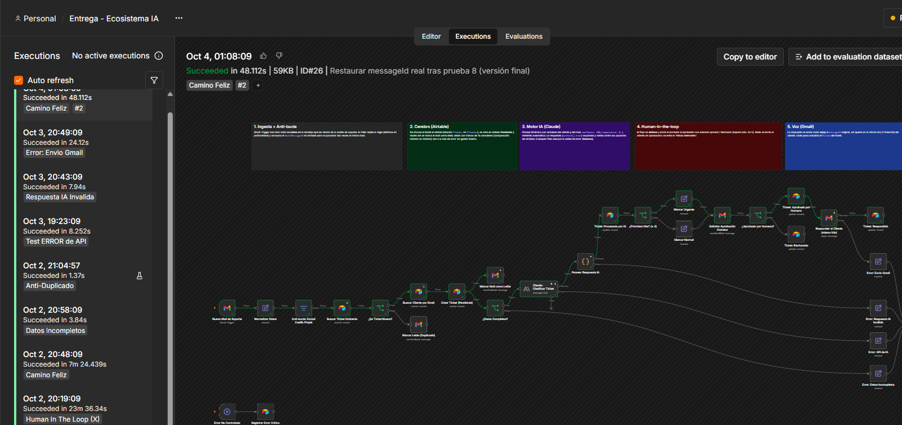
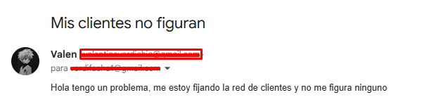
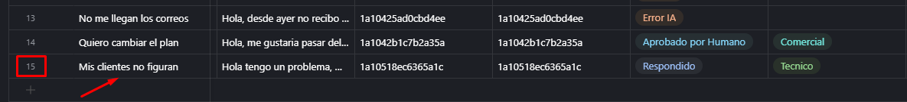
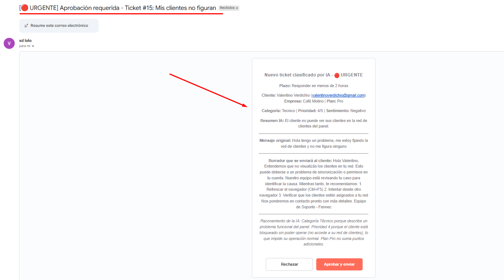
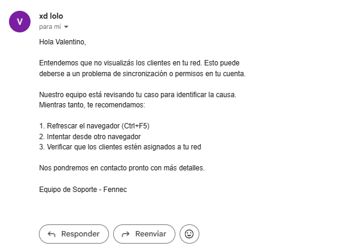
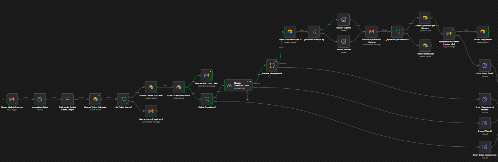
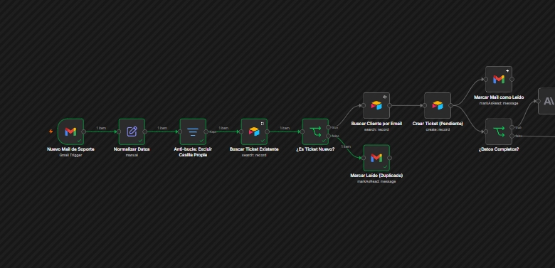
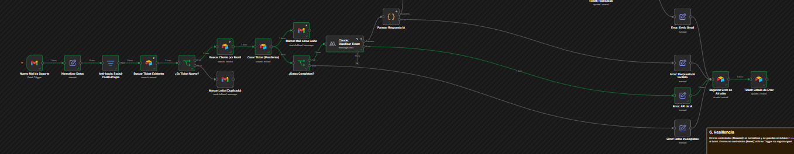
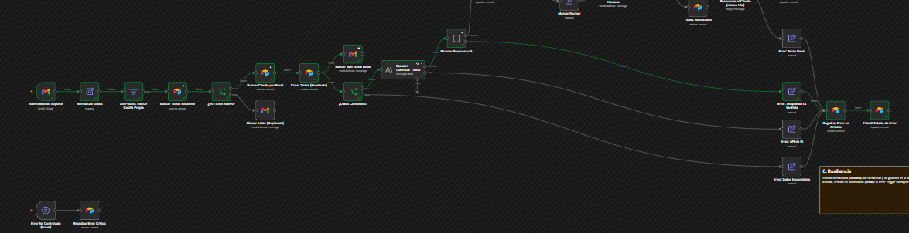
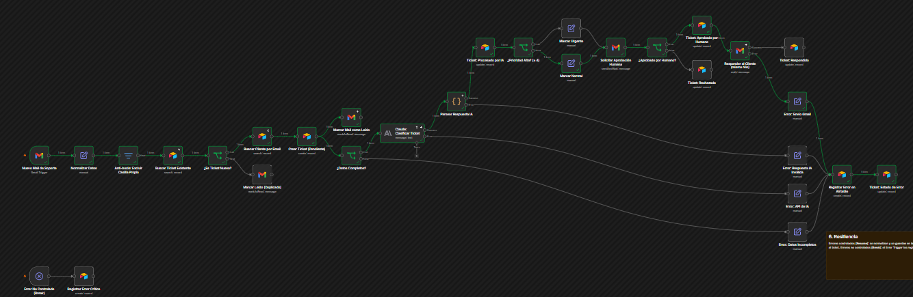

# Ecosistema de Automatización IA: Triage de soporte

Entrega final de **Valentino Verdichio**.

Armé un sistema que recibe mails de soporte, los guarda en una base de datos, los analiza con IA y prepara una respuesta. Antes de contestarle al cliente, una persona tiene que aprobar el borrador.

El caso de uso es **Fennec**, una empresa ficticia de hosting web que recibe consultas de sus clientes por mail.

## Herramientas

| Parte | Herramienta | Para qué la uso |
|---|---|---|
| Orquestador | **n8n** | Conecta todo y tiene la lógica del flujo |
| Base de datos | **Airtable** | Guarda clientes, tickets y errores |
| IA | **Claude Haiku 4.5** (Anthropic) | Clasifica el ticket y escribe el borrador |
| Canal | **Gmail** | Recibe los mails, pide la aprobación y responde al cliente |

## Archivos del repositorio

| Archivo | Qué es |
|---|---|
| `Diagrama_Arquitectura.pdf` | Diagrama del flujo y explicación paso a paso |
| `workflow_ecosistema_ia.json` | El flujo de n8n (se puede importar) |
| `capturas-n8n/` | Ejecuciones del flujo en n8n (una por prueba) |
| `capturas-gmail/` | Mails del camino feliz y el ticket en Airtable |

## Links

- **Base de datos (solo lectura):** https://airtable.com/appIkxzSD9TzBvlFy/shrzlgDC5BSZL0f0s
- **Video demo:** (https://youtu.be/xP0518C-ygM)

## Cómo funciona

1. **Llega un mail** a la casilla de soporte. n8n revisa Gmail cada minuto y solo trae mails nuevos y no leídos.
2. **Revisa si ya lo procesó:** busca el ID del mail en Airtable. Si ya existe lo ignora, así no se repite ni se generan bucles.
3. **Crea el ticket** en Airtable con estado `Pendiente`, vinculado al cliente que lo mandó.
4. **Valida el mensaje:** si tiene menos de 15 caracteres no se lo manda a la IA (para no gastar) y se guarda como error.
5. **Claude lo analiza** y devuelve categoría, prioridad del 1 al 5, sentimiento, resumen y un borrador de respuesta.
6. **Pide aprobación:** le manda el borrador por mail al aprobador con los botones *Aprobar* y *Rechazar*. El flujo se queda esperando la respuesta.
7. **Responde al cliente** en el mismo hilo del mail original. Si el borrador se rechaza, no se manda nada.
8. **Si algo falla**, el error se guarda en la tabla `Errores`, vinculado a su ticket.

### Base de datos

- **Clientes**: nombre, mail, empresa y plan.
- **Tickets**: cada mail recibido, con lo que dijo la IA y su estado.
- **Errores**: lo que salió mal, en qué nodo y en qué ticket.

Estados de un ticket: `Pendiente` → `Procesado por IA` → `Aprobado por Humano` → `Respondido` (o `Rechazado` / `Error IA`).

## Detalles técnicos que pedía la consigna

- **Trigger:** Gmail Trigger con filtro de búsqueda y solo mails no leídos. En modo activo solo toma mails nuevos.
- **IA:** nodo de Anthropic con `maxTokens: 600` y `temperature: 0.2`. La respuesta se lee de `content[].text` (el equivalente a `Message.Content`).
- **Prompt dinámico:** usa el nombre, la empresa y el plan del cliente, y el asunto y el texto del mail.
- **Manejo de errores:**
  - *Resume:* los nodos de Claude, del parseo de la respuesta y del envío por Gmail tienen salida de error. Si fallan, el flujo sigue y guarda el error en Airtable.
  - *Break:* un Error Trigger registra cualquier fallo que no estaba previsto.
- **Human-in-the-loop:** el nodo de Gmail "Send and Wait" frena el flujo hasta que alguien aprueba o rechaza.
- **Thread ID:** la respuesta se manda como *reply* del mail original, así queda en la misma conversación.

## Pruebas

| # | Qué probé | Resultado |
|---|---|---|
| 1 | Cliente registrado con un problema urgente | ✅ Llegó como URGENTE, lo aprobé y se respondió en el hilo |
| 2 | Rechazar el borrador | ✅ Ticket en `Rechazado`, el cliente no recibió nada |
| 3 | Mail que solo dice "hola" | ✅ No pasó por la IA y se guardó el error |
| 4 | Mail de alguien que no es cliente | ✅ Se creó el ticket sin cliente vinculado |
| 5 | El mismo mail procesado dos veces | ✅ Lo detectó y lo ignoró |
| 6 | Falla de la IA (puse un modelo que no existe) | ✅ Se guardó el error y el ticket quedó en `Error IA` |
| 7 | Respuesta de la IA cortada (bajé Max Tokens a 20) | ✅ No pudo leer el JSON, se guardó el error y el ticket quedó en `Error IA` |
| 8 | Falla al enviar la respuesta por Gmail | ✅ Se guardó el error y el ticket quedó en `Aprobado por Humano` (aprobado pero sin enviar) |

## Capturas

### Flujo en n8n

### Camino feliz (prueba 1)
El cliente manda el mail:

Se crea el ticket en Airtable:

Al aprobador le llega el borrador para aprobar o rechazar:

El cliente recibe la respuesta aprobada:

Recorrido de la ejecución en n8n:

### Camino infeliz: datos incompletos (prueba 3)

### Mail duplicado (prueba 5)

### Falla de la IA (prueba 6)

### Respuesta de la IA cortada (prueba 7)

### Falla del envío por Gmail (prueba 8)

### Base de datos
Los tickets, los clientes y los errores registrados se pueden ver en el [link de solo lectura de Airtable](https://airtable.com/appIkxzSD9TzBvlFy/shrzlgDC5BSZL0f0s).
